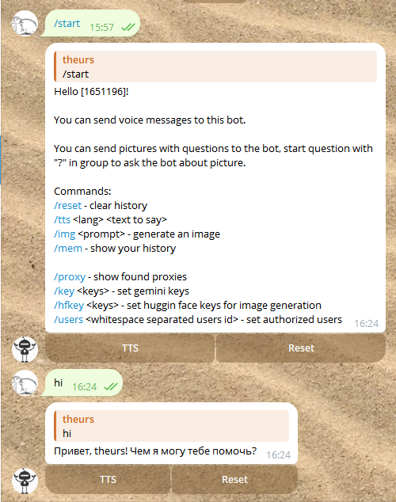
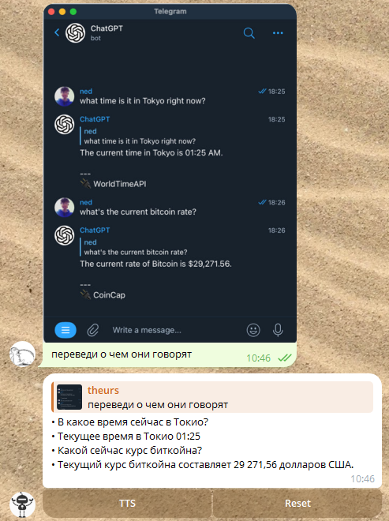
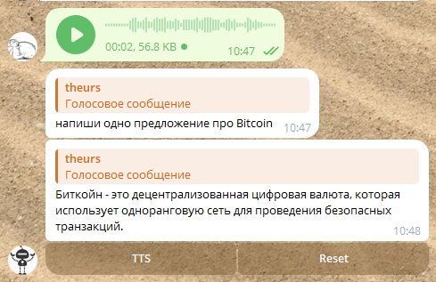

# tbg
Gemini Pro AI telegram bot [python]

## Features

• Responds to text, voice, photo, and video messages

• Uses speech recognition and text-to-speech to handle voice messages

• Answers questions about images when users send photos

  

# Install

git clone https://github.com/theurs/tbg.git

python -m venv .tb1

source ~/.tb1/bin/activate

cd tbg

pip install -r requirements.txt

sudo apt install ffmpeg

# Preparation steps:

1. Get free Gemini Pro API token(s) at https://ai.google.dev/ use VPN and multiple accounts if needed.
2. Get telegram bot token from @BotFather.
3. Set up cfg.py, see example.
4. Run bot ./tb.py or with systemd service (see example)

In windows download and install ffmpeg from https://ffmpeg.org/download.html
1. Download and run EXE file with telegram bot token as argument https://disk.yandex.ru/d/iP3CjfYpwd9knw
2. Set keys with /key command
3. Set users with /users command

# Report issues

https://t.me/theurs

